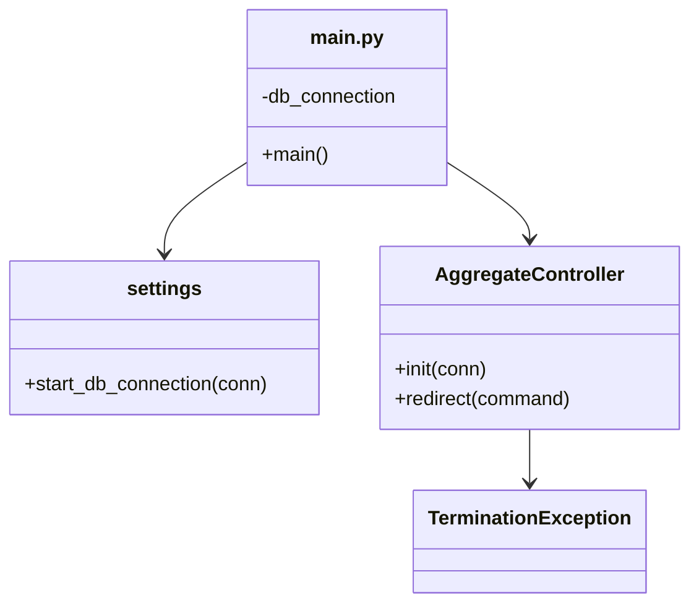

# 🗄️ BMS Main Program (`main.py`)

## 📖 Overview
This script is the **entry point** for the **Booking Management System (BMS)**.  
It handles:

- Initializing the **SQLite database connection**.
- Adding a custom SQL `REGEXP` function powered by Python’s `re` module.
- Launching the central `AggregateController` to route user commands.
- Gracefully shutting down when the `TerminationException` is triggered.

---

## ⚙️ Dependencies

- **Python** ≥ 3.6
- **Standard Libraries**:
  - `sqlite3` — Embedded SQL database.
  - `re` — Regular expression operations.
- **Project Modules**:
  - `settings.start_db_connection` — Configures DB initialization.
  - `controller.aggregate.AggregateController` — Core CLI controller.
  - `utils.exceptions.TerminationException` — Custom graceful-exit signal.

---

## 🧩 Code Flow

```mermaid
flowchart TD
    A[Start: main.py] --> B[Connect to SQLite: bms.db]
    B --> C[Register REGEXP Function]
    C --> D[start_db_connection(db_connection)]
    D --> E[AggregateController.init(db_connection)]
    E --> F[Loop: Prompt for Command]
    F -->|User Command| G[AggregateController.redirect()]
    G -->|TerminationException| H[Graceful Exit]
    G -->|Any Other Exception| I[Error Message + Termination]
    H --> J[Close DB Connection]
    I --> J[Close DB Connection]
    J --> K[System Terminated]
```

---

## 🛠 How It Works

### 1. **Database Setup**
```python
db_connection = sqlite3.connect('bms.db')
db_connection.create_function(
    'regexp', 2,
    lambda x, y: 1 if re.search(x, y) else 0
)
start_db_connection(db_connection)
```
- **Connects** to `bms.db` (creates it if missing).
- **Registers** `REGEXP` for SQL pattern matching.
- **Hands off** the connection to the system initializer.

---

### 2. **Controller Boot**
```python
AggregateController.init(db_connection)
```
- Loads the core command routing and system state.

---

### 3. **Interactive Command Loop**
```python
while True:
    AggregateController.redirect(input("\nEnter command:\n"))
```
- Waits for user input.
- Passes commands to the `redirect` method for execution.

---

### 4. **Exception Handling**
- **`TerminationException`** → Clean exit.
- **Other Exceptions** → Printed, then shut down.

---

### 5. **Cleanup**
```python
db_connection.close()
print("System terminated")
```
- Closes DB connections **every time**, ensuring no corruption.

---

## ▶️ Usage

1. **Run the program**
```bash
python3 main.py
```
2. **Enter a command**
```plaintext
Enter command:
```

> Commands depend on the implementation in `AggregateController`.  
> Examples: `addUser`, `listBookings`, `exit`.

---

## 🔍 Example Commands
*(May vary depending on your controller logic)*
```plaintext
addUser --name Alice --role admin
bookItem --member Bob --date 2025-08-15 --duration 2h --item battery
exit
```

---

## 🧠 Design Notes
- **Custom REGEXP** enables advanced filtering inside SQL queries.
- Clean **resource management** ensures DB stability.
- **Loose coupling**: `main.py` doesn’t handle business logic—just orchestration.

---

## 🗺 System Context



---

## 📌 Notes
- **Data file:** `bms.db` in the local directory.
- **Logging/Debugging:** To be implemented or extended in controllers.
- **Extensibility:** Can integrate with more controllers or automated scripts.

---

## 👤 Author
**[Jasper]**  
Booking Management System Project — 2025
